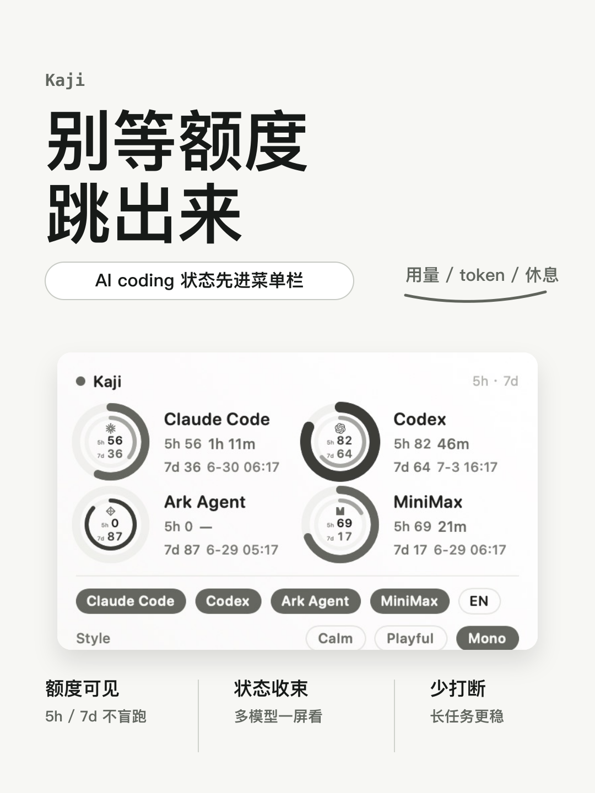

# Social Media Skills

中文社交媒体内容技能集。面向小红书、抖音、公众号，帮助 Agent 生成平台原生的文案、封面、图文页纲和跨平台内容包。

## 它解决什么

很多 Agent 会把不同平台写成同一篇短文：公众号像小红书，小红书像产品公告，抖音口播像书面稿。

这个仓库把平台拆成独立技能，让 Agent 先判断内容形态，再输出对应平台真正能用的资产。

## 安装

```bash
git clone https://github.com/MisterBrookT/social-media-skills.git
cd social-media-skills
./setup.sh
```

`setup.sh` 会把 `skills/` 下的技能链接到本机 Codex / Claude Code 技能目录。脚本使用符号链接，更新仓库文件后，新会话会读到新版技能。

## 当前技能

| 技能 | 适用场景 | 主要产物 |
| --- | --- | --- |
| `xiaohongshu` | 小红书笔记、产品发布、封面、图文卡片 | 标题、封面大字、正文、标签、图文页纲、评论钩子 |
| `douyin` | 抖音短视频、口播、封面标题 | 前 3 秒钩子、口播稿、画面提示、话题 |
| `wechat` | 公众号长文、观点文、产品说明 | 标题组、摘要、正文、封面文案、互动引导 |

没有 `social-media` 总入口技能。仓库名已经说明这是社媒技能库；`skills/` 里只放真正可触发的平台技能。

## 小红书封面能力

`xiaohongshu` 内置封面类型判断：

- 产品封面：真实截图 + 品牌名 + 一句话定位。
- 方法封面：教程、流程、经验，强调步骤感和收藏感。
- 观点封面：判断、反常识、痛点，强调冲突。
- 资料封面：合集、清单、模板，强调范围和复用。

产品类封面必须优先使用真实截图。截图是证据，不是装饰。

## 案例展示

### Kaji 小红书产品封面

产品类封面。重点验证：品牌名可见、真实截图作证、主标题是产品定位、底部卖点短且平行。

<p>
  
</p>

- 文案：[cases/kaji-launch/copy/xiaohongshu-copy.md](cases/kaji-launch/copy/xiaohongshu-copy.md)
- 封面源文件：[cases/kaji-launch/cover/cover-d-clean-product.svg](cases/kaji-launch/cover/cover-d-clean-product.svg)
- 封面规则：[skills/xiaohongshu/references/cover.md](skills/xiaohongshu/references/cover.md)

更多案例会继续放到 `cases/`。每个案例只保留可展示资产；路线、判断、复盘沉淀到 Obsidian 项目知识库。

## 仓库结构

```text
skills/
  xiaohongshu/
    SKILL.md
    references/
  douyin/
    SKILL.md
  wechat/
    SKILL.md

cases/
  kaji-launch/
  xiaohongshu-launch/

docs/
  repo-structure.md
  dogfooding-workflow.md
  references/
```

结构参考 `superpowers`：顶层 skill 平铺；同平台子能力放在该平台目录的 `references/`。

## 开发循环

1. 用当前技能做一个真实案例。
2. 把成品资产放进 `cases/<project>-launch/`。
3. 把复盘沉淀到 Obsidian 项目知识库。
4. 抽取可复用规则，写回 `skills/*/SKILL.md` 或 `references/`。
5. 用新版技能重做同一案例或做下一个案例。

## 边界

- 不自动登录平台。
- 不自动发布内容。
- 不伪造数据、用户反馈、真实体验。
- 不把跨平台内容写成同一篇短文。

## 许可证

MIT
