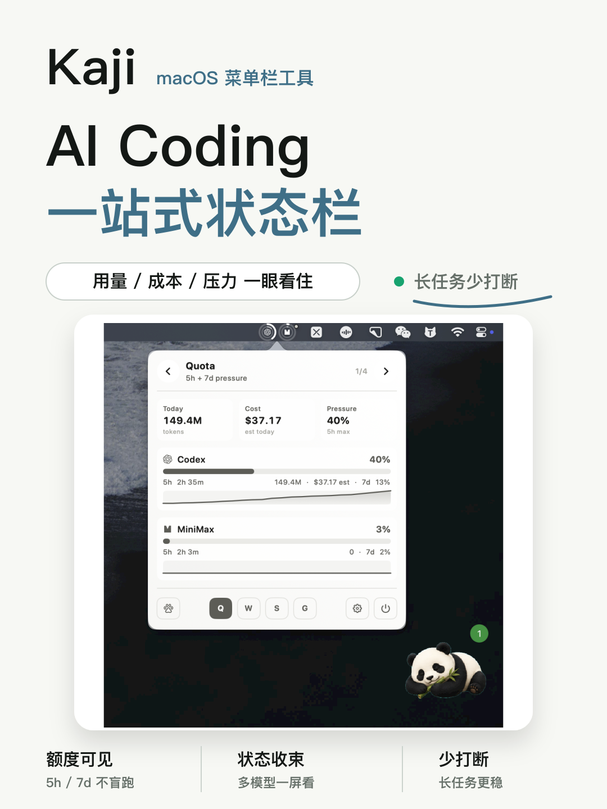
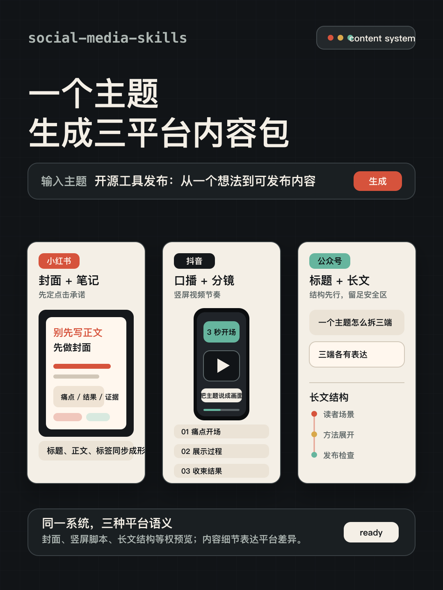

<div align="center">


# Social Media Skills

**中文社媒内容资产技能库。**

把一个主题变成小红书、抖音、公众号原生内容包：文案、封面、图文页纲、口播脚本。

<a href="https://github.com/MisterBrookT/social-media-skills/stargazers"></a>

<a href="LICENSE"></a>

</div>

## 案例

### 小红书产品封面

隔离 Codex 使用本仓库 `xiaohongshu` skill 生成。每个 case 保留轻 prompt、输出图、SVG 源文件和测试记录。

<table>
  <tr>
    <td width="50%" align="center">
      
      <br />
      <sub>Kaji：真实截图证明产品形态，品牌名和定位优先。</sub>
    </td>
    <td width="50%" align="center">
      
      <br />
      <sub>social-media-skills：一个主题生成三平台内容包。</sub>
    </td>
  </tr>
</table>

- Kaji：[prompt](cases/xiaohongshu-cover/product-kaji/prompt.md) · [output.png](cases/xiaohongshu-cover/product-kaji/output.png) · [notes](cases/xiaohongshu-cover/product-kaji/notes.md)
- social-media-skills：[prompt](cases/xiaohongshu-cover/product-social-media-skills/prompt.md) · [output.png](cases/xiaohongshu-cover/product-social-media-skills/output.png) · [notes](cases/xiaohongshu-cover/product-social-media-skills/notes.md)
- 规则：[xiaohongshu/references/cover.md](skills/xiaohongshu/references/cover.md)

后续案例按能力分类放进 `cases/`。案例目录保留 prompt、输出、源文件和测试记录；路线、判断、复盘沉淀到 Obsidian 项目知识库。

## 为什么

很多 Agent 会把不同平台写成同一篇短文：公众号像小红书，小红书像产品公告，抖音口播像书面稿。

这个仓库把平台拆成独立技能，让 Agent 先判断内容形态，再输出对应平台真正能用的资产。

## 安装

```bash
git clone https://github.com/MisterBrookT/social-media-skills.git
cd social-media-skills
./setup.sh
```

`setup.sh` 会把 `skills/` 下的技能链接到本机 Codex / Claude Code 技能目录。脚本使用符号链接，更新仓库文件后，新会话会读到新版技能。

## 当前技能

| 技能 | 适用场景 | 主要产物 |
| --- | --- | --- |
| `xiaohongshu` | 小红书笔记、产品发布、封面、图文卡片 | 标题、封面大字、正文、标签、图文页纲、评论钩子 |
| `douyin` | 抖音短视频、口播、封面标题 | 前 3 秒钩子、口播稿、画面提示、话题 |
| `wechat` | 公众号长文、观点文、产品说明 | 标题组、摘要、正文、封面文案、互动引导 |

没有 `social-media` 总入口技能。仓库名已经说明这是社媒技能库；`skills/` 里只放真正可触发的平台技能。

## 小红书封面能力

`xiaohongshu` 内置封面类型判断：

- 产品封面：真实截图 + 品牌名 + 一句话定位。
- 方法封面：教程、流程、经验，强调步骤感和收藏感。
- 观点封面：判断、反常识、痛点，强调冲突。
- 资料封面：合集、清单、模板，强调范围和复用。

产品类封面必须优先使用真实截图。截图是证据，不是装饰。

## 工作方式

```text
素材输入 -> 平台判断 -> 内容资产 -> 案例验证 -> 规则回写
```

每个真实案例至少反哺一条规则。满意样例写回 `skills/`，过程复盘放到项目知识库。

## 仓库结构

```text
skills/
  xiaohongshu/
    SKILL.md
    references/
  douyin/
    SKILL.md
  wechat/
    SKILL.md

cases/
  xiaohongshu-cover/
    product-kaji/
      prompt.md
      output.png
      output.svg
      notes.md
    product-social-media-skills/
      prompt.md
      output.png
      output.svg
      notes.md

docs/
  repo-structure.md
  dogfooding-workflow.md
  references/
```

## 边界

- 不自动登录平台。
- 不自动发布内容。
- 不伪造数据、用户反馈、真实体验。
- 不把跨平台内容写成同一篇短文。

## 许可证

MIT
